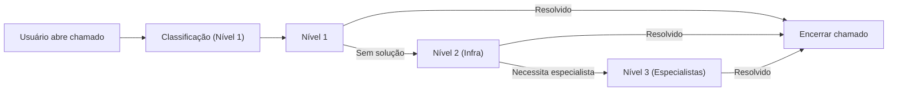
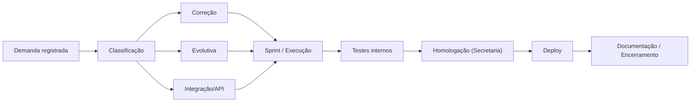

# MI-2025-006 — SLA e Governança Operacional (Infraestrutura)
**Diretoria de Tecnologia da Informação — DITI**  
**Prefeitura Municipal de Hortolândia**  
**Ano-base: 2025**

---

## 1. Finalidade
Estabelecer padrões de atendimento, tempos de resposta, responsabilidades, fluxos de trabalho, indicadores e mecanismos de governança aplicáveis **exclusivamente às atividades de infraestrutura, suporte técnico, redes, data center, equipamentos, conectividade e continuidade operacional**.

Esta MI não se aplica ao desenvolvimento, manutenção evolutiva ou parametrização de sistemas. Tais atividades serão tratadas na MI-2025-007.

---

## 2. Escopo
Este documento rege:

- Suporte técnico Nível 1 (Service Desk)  
- Infraestrutura de TI (Nível 2)  
- Segurança, redes, conectividade  
- Data center, servidores, máquinas virtuais  
- Inventário, backup e continuidade  
- Fornecedores associados à infraestrutura  
- Atividades emergenciais e preventivas  

**Não contempla:**  
- Desenvolvimento de sistemas  
- Manutenção evolutiva  
- Criação de integrações  
- Parametrizações sistêmicas  
- Projetos de software  

Esses processos pertencem à **DSTI** e terão SLA próprio.

---

## 3. Definições
**Chamado:** Registro formal de solicitação ou incidente.  
**Prioridade:** Classificação A (crítica), B (alta), C (moderada).  
**Níveis de atendimento:**  
- **Nível 1:** Service Desk  
- **Nível 2:** Infraestrutura / Redes  
- **Nível 3:** Especialistas de Infra, Segurança ou Banco de Dados  

**TMR:** Tempo médio de resposta.  
**TMS:** Tempo médio de solução.  
**MTTR:** Tempo médio de reparo.  
**Janela de manutenção:** Período autorizado para intervenção preventiva.  
**PCO:** Plano de Correção Obrigatória (uso interno, não punitivo).

---

## 4. Fluxo de Atendimento

### 4.1 Etapas do Processo
1. Abertura do chamado (usuário)  
2. Triagem e classificação (Nível 1)  
3. Atendimento inicial (Nível 1)  
4. Escalonamento para Nível 2  
5. Ação técnica (rede, servidor, equipamento, acesso, backup etc.)  
6. Escalonamento para Nível 3, se necessário  
7. Teste e validação  
8. Encerramento e evidências  
9. Atualização da Base de Conhecimento  

---

### 4.2 Fluxo (diagrama Mermaid)

---

### 4.3 Responsabilidades (RACI)

| Processo / Atividade           | Nível 1 (SD) | Nível 2 (Infra) | Nível 3 (Especialistas) | Secretaria | Fornecedor |
|-------------------------------|--------------|------------------|---------------------------|------------|------------|
| Registro do chamado           | R            | C                | C                         | A          | –          |
| Triagem e classificação       | R            | C                | –                         | –          | –          |
| Suporte remoto                | R            | C                | –                         | –          | –          |
| Suporte presencial            | –            | R                | –                         | –          | –          |
| Incidentes críticos           | C            | R                | A                         | C          | R/C        |
| Backup / Restore              | –            | R                | C                         | –          | –          |
| Monitoramento do Data Center  | –            | R                | C                         | –          | –          |
| Segurança e acessos           | C            | R                | A                         | –          | C          |
| Problemas recorrentes         | C            | R                | R                         | –          | C          |
| Validação do usuário          | –            | –                | –                         | R          | –          |
| Encerramento                  | R            | C                | C                         | –          | –          |

Legenda: **R = responsável**, **A = aprovador**, **C = consultado**  

---

## 5. Tempos de Atendimento (SLA)

### 5.1 Prioridade A — Crítica
- Interrupção total de serviço essencial  
- Rede ou data center indisponível  
- Sistemas críticos sem acesso  
- Falhas que impactam diretamente o cidadão  

**TMR:** até 15 minutos  
**TMS:** até 4 horas  
**Ação obrigatória:** abertura de incidente + relatório pós-evento  

---

### 5.2 Prioridade B — Alta
- Problemas que afetam equipes inteiras  
- Falhas intermitentes de rede  
- Equipamentos essenciais parados  

**TMR:** até 1 hora  
**TMS:** até 12 horas  

---

### 5.3 Prioridade C — Moderada
- Demandas individuais  
- Configurações, ajustes, permissões  
- Troca de periféricos  

**TMR:** até 4 horas  
**TMS:** até 48 horas  

---

## 6. Indicadores de Desempenho (KPIs)

### 6.1 Operacionais
- % de atendimentos dentro do SLA  
- TMR  
- TMS  
- MTTR (infraestrutura)  
- % de chamados reabertos  

### 6.2 Disponibilidade
- Disponibilidade da rede  
- Disponibilidade do data center  
- Disponibilidade da internet  

### 6.3 Segurança
- Incidentes por severidade  
- Aplicação de patches dentro da janela de conformidade  
- Tentativas de acesso bloqueadas  

### 6.4 Continuidade
- Sucesso dos backups diários  
- Sucesso dos testes de restore  
- Registro de falhas de energia (UPS / nobreak)

---

## 7. Governança Operacional

### 7.1 Base de Conhecimento
Todo incidente resolvido deve gerar artigo na BK.

### 7.2 Auditoria Interna
A DITI deve produzir:
- Relatório mensal de SLAs  
- Estatísticas de incidentes  
- Top 10 problemas  

### 7.3 Gestão de Problemas
Incidentes recorrentes devem gerar análise de causa raiz (ACR).

### 7.4 Plano de Correção Obrigatória (PCO)
Aplicado **à equipe ou ao processo**, nunca ao servidor individual.  
O objetivo é **melhorar o fluxo, não punir pessoas**.

---

## 8. Janelas de Manutenção
- Quartas-feiras, 19h–22h  
- Sábados, 08h–12h  

Manutenções emergenciais exigem comunicação imediata.

---

## 9. Fornecedores e Terceiros
Sanções aplicáveis via contrato:
- Advertência  
- Glosa  
- Multa conforme 14.133  
- PCO contratual  

**Jamais aplicável a servidores públicos.**

---

## 10. Conexão com o Data Lakehouse Municipal
A regularidade dessas rotinas garante:
- Coleta sistemática de logs  
- Rastreabilidade de incidentes  
- Dados confiáveis para ETL  
- Aderência às diretrizes RAJIS  
- Governança técnica baseada em evidências  

---

## 11. Vigência
Esta MI entra em vigor na data de sua publicação e deve ser revisada anualmente.

---

## 12. Anexos
- Anexo I — Fluxo Mermaid  
- Anexo II — Tabelas de SLA  
- Anexo III — Relatório de incidente  
- Anexo IV — Matriz RACI expandida  
✅ PRONTO
Este é o MI-2025-006 revisado, exclusivo para infraestrutura, profissional, juridicamente seguro e totalmente coerente com a futura MI-2025-007 (desenvolvimento).

Se quiser, posso gerar o MI-2025-007 agora mesmo — basta dizer:

👉 Gerar MI-2025-007

1/2

Você disse:
Ok, gerar MI-2025-007

O ChatGPT disse:
Perfeito. Vamos fazer tudo na ordem certa, limpo, profissional, institucional e pronto para GitHub.

Primeiro você pediu:

✅ 1. MI-2025-006 (Revisado)
(exclusivo para Infraestrutura / Operações / Governança Operacional)

Depois:

✅ 2. MI-2025-007 (Novo)
(exclusivo para Desenvolvimento / Sistemas / Evolutivas / Integrações)

A seguir te entrego o MI-2025-007 COMPLETO, já no mesmo padrão editorial do MI-006 revisado, e 100% em Markdown bruto, pronto para colar no GitHub.

🚀 MI-2025-007 — SLA de Desenvolvimento e Governança Evolutiva (DSTI)
Diretoria de Soluções em Tecnologia da Informação — Prefeitura Municipal de Hortolândia
Ano-base: 2025

markdown
Copiar código
# MI-2025-007 — SLA de Desenvolvimento e Governança Evolutiva (DSTI)
Diretoria de Soluções em Tecnologia da Informação – Prefeitura Municipal de Hortolândia  
Ano-base: 2025

---

## 1. Finalidade
Estabelecer o **Acordo de Nível de Serviço (SLA)** e os mecanismos de **governança evolutiva** aplicáveis às atividades de desenvolvimento de sistemas, integrações, manutenção evolutiva, sustentação lógica e modernização tecnológica conduzidas pela DSTI.

Este documento complementa a MI-2025-006 (Infraestrutura) e define um **modelo exclusivo** para o ciclo de desenvolvimento de software, garantindo produtividade, previsibilidade e valor público.

---

## 2. Escopo
Aplica-se a:
- Desenvolvimento de novos sistemas municipais  
- Evolutivas e corretivas sistêmicas  
- APIs, integrações e interoperabilidade  
- Banco de dados lógico (modelagem, consultas, ajustes)  
- Parametrização de sistemas corporativos  
- Sustentação funcional e técnicas de sistemas legados  
- Projetos de modernização tecnológica  
- Gestão de backlog e versionamento  
- Mediação com fornecedores de software  

Não se aplica à infraestrutura, redes, suporte operacional ou data center (regidos pela MI-2025-006).

---

## 3. Definições
**Backlog:** lista priorizada de demandas.  
**Sprint:** ciclo iterativo de entrega.  
**Deploy:** publicação de versão.  
**Hotfix:** correção emergencial.  
**Change Request (CR):** pedido formal de mudança.  
**Bug:** defeito técnico ou funcional do sistema.  
**Lead Time:** tempo total entre solicitação e entrega.  
**Cycle Time:** tempo efetivo de execução.  
**Release:** conjunto de entregas versionadas.

---

## 4. Fluxo de Atendimento Evolutivo

### 4.1 Etapas
1. Registro da demanda (Secretaria / DITI / Governança)  
2. Classificação por tipo:  
   - Correção  
   - Evolução  
   - Integração  
   - Projeto  
3. Priorização pelo comitê de TI / governança  
4. Planejamento de Sprint  
5. Desenvolvimento  
6. Testes internos (QA)  
7. Homologação com a secretaria solicitante  
8. Publicação (deploy)  
9. Documentação e versionamento  
10. Encerramento e registro de melhoria contínua

---

## 4.2 Fluxo Mermaid

---

## 5. Critérios de Priorização
1. **Impacto no cidadão**  
2. **Risco operacional**  
3. **Dependência de outros sistemas**  
4. **Alinhamento ao PDTI e ao PPA municipal**  
5. **Urgência institucional**  
6. **Disponibilidade técnica**

---

## 6. Indicadores (KPIs) Obrigatórios — DSTI

### 6.1 KPIs de Entrega
- **% de entregas concluídas no sprint**  
- **Lead Time por demanda**  
- **Cycle Time**  
- **Velocidade média do time (velocity)**  
- **% de demandas entregues no prazo pactuado**  

### 6.2 KPIs de Qualidade
- **Bugs pós-deploy por versão**  
- **Índice de retrabalho**  
- **Taxa de rejeição em homologação**  

### 6.3 KPIs de Interoperabilidade
- **Integrações/API entregues por mês**  
- **Tempo de resposta a solicitações de dados**  
- **Conformidade com padrões de API municipais**  

### 6.4 KPIs de Valor Público
- **Redução de tempo de atendimento ao cidadão**  
- **Secretarias atendidas por release**  
- **Adoção dos sistemas**  

---

## 7. Prazos e Níveis de Serviço

### 7.1 Classificação das demandas
- **Crítico:** sistema parado / impedimento total  
- **Alto:** falha grave, operação prejudicada  
- **Médio:** erro funcional sem parada  
- **Baixo:** melhorias, ajustes, cosméticos  

### 7.2 Prazos recomendados
| Tipo de Demanda | Nível | Tempo de Resposta | Tempo de Solução |
|-----------------|-------|-------------------|-------------------|
| Correção Crítica | A | 1h | 4–12h |
| Correção Alta | B | 4h | 24–48h |
| Correção Média | C | 24h | 5 dias úteis |
| Evolutiva | – | 48h | Sprint definido |
| Integração | – | 48h | Por release |
| Projeto | – | 48h | Plano detalhado |

---

## 8. Governança e Comitês
- Priorizações não são feitas pelo desenvolvedor individual  
- Comitê GUIA: Governança, Usuário, Infra, Análise técnica  
- Homologação é obrigatória  
- Deploy sem documentação é proibido  
- Todo sistema deve ter **dono funcional**  

---

## 9. RACI — Desenvolvimento

| Atividade | DSTI | DITI | Secretaria | Fornecedor |
|-----------|------|------|-----------|-----------|
| Análise da demanda | R | C | C | C |
| Desenvolvimento | R | – | – | C |
| Integração | R | C | – | C |
| Testes | R | C | C | – |
| Homologação | – | – | R | – |
| Deploy | R | C | – | C |
| Documentação | R | – | – | – |
| Treinamento | C | – | R | – |

Legenda: R = Responsável / C = Consultado

---

## 10. Documentação Obrigatória
- Release Notes  
- Versionamento  
- Diagrama da solução  
- Histórico de mudanças  
- Scripts SQL versionados  
- APIs padronizadas  
- Manual funcional básico  

---

## 11. Conexão com o Data Lakehouse Municipal
O cumprimento deste SLA assegura:
- padronização das integrações,  
- previsibilidade de dados para ETL,  
- redução de inconsistências,  
- governança do modelo RAJIS,  
- rastreabilidade para auditorias.

---

## 12. Contratos e Fornecedores
Sanções são aplicáveis **somente a fornecedores**, nunca a servidores.  
Aplicáveis:
- glosa por entrega incompleta  
- advertência formal  
- exigência de PCO  
- retenção de pagamento  

---

## 13. Vigência
Esta MI entra em vigor na data de sua aprovação e deve ser revisada anualmente ou mediante evolução tecnológica.

---

## 14. Anexos
- Anexo I: Fluxo Mermaid  
- Anexo II: Tabela de Priorização  
- Anexo III: Modelo de Release Notes  
- Anexo IV: Padrões de API  
