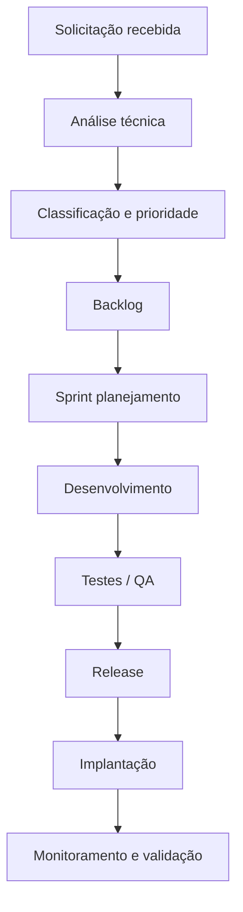

# MI-2025-007 — SLA de Desenvolvimento, Evolutivas e Interoperabilidade de Sistemas (DSTI)
**Departamento de Soluções em Tecnologia da Informação — Prefeitura Municipal de Hortolândia**  
**Ano-base: 2025**

---

## 1. Finalidade
Estabelecer o Acordo de Nível de Serviço (SLA) específico para as atividades de **desenvolvimento, manutenção evolutiva, sustentação de sistemas, APIs e integrações**, conduzidas pelo **DSTI**.

Este SLA complementa o MI-2025-006, que regula exclusivamente as atividades da **DITI (Infraestrutura e Operações)**.

---

## 2. Escopo
Aplica-se às atividades de:
- Desenvolvimento de sistemas internos  
- Manutenção evolutiva e corretiva  
- Sustentação de sistemas corporativos  
- Administração de versões e releases  
- Integrações entre sistemas (APIs, ETLs, automações)  
- Governança de arquitetura de software  
- Parametrização avançada de sistemas adquiridos  
- Suporte técnico para desenvolvedores e analistas

Não se aplica a:
- Infraestrutura de rede  
- Suporte técnico ao usuário  
- Data Center, servidores e backup  
*(Vide MI-2025-006)*

---

## 3. Definições
**Backlog:** lista priorizada de itens a serem desenvolvidos.  
**Sprint:** ciclo de trabalho com duração fixa.  
**Release:** entrega formal de nova versão.  
**Hotfix:** correção emergencial de defeito crítico.  
**API:** interface de integração entre sistemas.  
**Evolutiva:** melhoria de funcionalidade existente.  
**Corretiva:** ajuste para resolver erro.  
**Interoperabilidade:** capacidade de troca de dados entre sistemas.

---

## 4. Categorias de Atividades
1. **Desenvolvimento de novas funcionalidades**  
2. **Evolutivas em sistemas existentes**  
3. **Correções (bugs)**  
4. **Integrações sistêmicas (APIs)**  
5. **Automação de processos (RPA/ETL)**  
6. **Parametrizações complexas**  
7. **Análises técnicas e pareceres de software**  

---

## 5. Prioridades e Prazos

### **5.1 Prioridade A — Crítica**
Situações que interrompem serviços essenciais ao cidadão ou a processos administrativos críticos.

- Resposta: até 2h  
- Correção emergencial (hotfix): até 8h  
- Comunicação ao gestor: imediata  

### **5.2 Prioridade B — Alta**
Problemas que afetam setores inteiros, mas com alternativas temporárias.

- Resposta: 4h  
- Solução: até 48h  
- Registro obrigatório no backlog  

### **5.3 Prioridade C — Média**
Ajustes funcionais, erros não bloqueadores, pequenas evolutivas.

- Resposta: 1 dia útil  
- Solução: conforme planejamento de sprint  

### **5.4 Prioridade D — Baixa**
Melhorias, evoluções estratégicas e novos módulos.

- Atendidas via backlog  
- Planejamento trimestral  
- Entregas vinculadas ao PPA e PDTI  

---

## 6. Fluxo de Trabalho (Desenvolvimento)

### **6.1 Etapas**
1. Solicitação  
2. Análise preliminar  
3. Classificação por prioridade  
4. Inserção no backlog  
5. Refinamento técnico  
6. Planejamento de sprint  
7. Desenvolvimento  
8. Testes (QA)  
9. Release  
10. Implantação  
11. Monitoramento pós-implantação  

---

## 7. Fluxograma (Mermaid)

---

## 8. KPIs Obrigatórios (DSTI)

### **KPIs de Entrega**
- Velocidade média do time  
- Percentual de entregas concluídas por sprint  
- Lead Time (criação → entrega)  
- Cycle Time (início → fim do desenvolvimento)  

### **KPIs de Qualidade**
- Defeitos por release  
- Taxa de retrabalho  
- Tempo médio para correção (bug fix)  
- % de releases com rollback  

### **KPIs de Usuário**
- Índice de satisfação  
- Taxa de adoção  
- Tempo médio de resposta a solicitações técnicas  

### **KPIs de Governança**
- Documentação atualizada  
- Taxa de APIs padronizadas  
- Conformidade com arquitetura  
- Integrações disponíveis no catálogo  

---

## 9. RACI

| Atividade                        | DSTI | DITI | Secretaria | Fornecedor |
|---------------------------------|------|------|-----------|------------|
| Desenvolvimento                 | R    | C    | C         | C/R        |
| Sustentação de sistemas         | R    | C    | C         | C/R        |
| Parametrizações complexas       | R    | –    | C         | C/R        |
| Integrações (API)              | R    | C    | –         | C/R        |
| Documentação técnica            | R    | –    | –         | C          |
| Releases / versões              | R    | C    | –         | C/R        |
| Backlog                         | R    | –    | C         | –          |

---

## 10. Exclusões (Importante)
Este SLA **não** cobre:
- Atendimento ao usuário  
- Suporte técnico  
- Rede, servidores, data center  
*(vide MI-2025-006)*

---

## 11. Conexão com o Data Lakehouse
Este SLA garante:
- Qualidade dos dados de origem  
- Estabilidade das integrações  
- Documentação técnica para pipelines  
- Redução de inconsistências  
- Rastreabilidade entre sistemas municipais  

---

## 12. Vigência
Esta MI entra em vigor na data de sua publicação e deve ser revisada anualmente ou conforme necessidade institucional.

---
