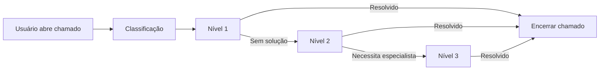

# MI-2025-006 — SLA e Governança Operacional  
**Diretoria de Tecnologia da Informação – Prefeitura Municipal de Hortolândia**  
**Ano-base: 2025**

---

## 1. Finalidade
Estabelecer o **Acordo de Nível de Serviço (SLA)**, o fluxo operacional, os padrões de responsabilidade, os indicadores e os mecanismos de controle interno aplicáveis ao atendimento técnico e à governança operacional da DITI.

---

## 2. Escopo
Aplica-se a:
- Central de Atendimento (Nível 1)  
- Equipe técnica de infraestrutura (Nível 2)  
- Equipe de sistemas e banco de dados (Nível 3)  
- Fornecedores externos  
- Secretarias usuárias  
- Governança e auditoria  
- Todos os sistemas, redes, serviços e ativos tecnológicos municipais.

---

## 3. Definições
**Chamado:** Registro formal de solicitação ou incidente.  
**Prioridade (A/B/C):** Grau de criticidade e impacto no serviço.  
**Níveis 1, 2 e 3:** Estrutura de atendimento.  
**TMR:** Tempo médio de resposta.  
**TMS:** Tempo médio de solução.  
**MTTR:** Tempo médio de reparo.  
**RACI:** Modelo de responsabilidade.

---

## 4. Fluxo de Atendimento e Governança

### 4.1 Etapas do Processo
1. Abertura do chamado  
2. Classificação e triagem  
3. Atendimento inicial (Nível 1)  
4. Escalonamento técnico (Nível 2/3)  
5. Resolução  
6. Validação com usuário  
7. Encerramento  
8. Registro no Catálogo de Problemas (quando aplicável)

---

## 4.2 Fluxo (versão esquemática em Mermaid)

**Observação:** Este diagrama poderá ser exportado posteriormente em `.svg` e armazenado na pasta `99-imagens`.

---

## 4.3 Padrões de Responsabilidade

| Etapa do Processo            | Responsável Principal | Apoio |
|-----------------------------|------------------------|-------|
| Abertura do chamado         | Usuário / Secretaria   | –     |
| Classificação e triagem     | Nível 1 (Service Desk) | –     |
| Escalonamento técnico       | DITI/DSTI (Nível 2/3)  | Fornecedores |
| Resolução                   | Equipe técnica         | Sistemas / Fornecedor |
| Validação                   | Usuário solicitante    | –     |
| Encerramento                | Service Desk           | –     |
| Registro de problemas       | Governança de TI       | DITI/DSTI |

---

## 5. Diretrizes Operacionais
- Todo atendimento deve ser registrado no sistema oficial da DITI.  
- A classificação segue a matriz de prioridade A → B → C.  
- Chamados críticos exigem registro de incidente com rastreabilidade.  
- Nenhum chamado pode ser encerrado sem validação do usuário.  
- Atendimentos presenciais ocorrem somente após triagem formal.  
- Evidências técnicas (prints, logs) são obrigatórias em incidentes.  
- Desvio de SLA requer Análise de Causa (5 porquês / Ishikawa).

---

## 6. Integração com Governança, Auditoria e Lakehouse
O cumprimento deste SLA permite:
- Regularidade das coletas de dados  
- Rastreabilidade dos incidentes  
- Melhoria contínua do catálogo de serviços  
- Confiabilidade para automações e ETL  
- Integração com o Data Lakehouse e RAJIS (Pessoa–Família–Território)

---

## 7. Indicadores Obrigatórios (KPIs)
- % de atendimento dentro do SLA  
- Tempo médio de resposta (TMR)  
- Tempo médio de solução (TMS)  
- Disponibilidade dos sistemas críticos  
- % de chamados reabertos  
- Incidentes por secretaria  
- MTTR por categoria  
- Top 10 problemas recorrentes  
- Taxa de escalonamentos desnecessários  

---

## 8. Matriz RACI Operacional

| Atividade / Processo        | DITI | DSTI | Secretaria | Fornecedor |
|-----------------------------|------|------|-----------|-----------|
| Suporte ao usuário          | R    | C    | –         | C         |
| Infraestrutura de redes     | R    | C    | –         | C/R       |
| Sistemas corporativos       | –    | R    | –         | C/R       |
| Data Center / virtualização | R    | C    | –         | C/R       |
| Segurança da Informação     | R    | C    | –         | C         |
| Backups / contingência      | R    | C    | –         | C         |
| Integrações e projetos      | Um   | R    | C         | C         |
| Governança e documentação   | Um   | R    | C         | C         |

Legenda: **R = Responsável**, **A = Aprovador**, **C = Consultado**, **Um = Unidade mínima / liderança técnica**

---

## 9. Janelas de Manutenção
- **Quartas-feiras**: 19h–22h  
- **Sábados**: 08h–12h  

Manutenções emergenciais seguem fluxo rápido de aprovação pela Diretoria.

---

## 10. Penalidades e Prioridades

### 10.1 Penalidades a fornecedores
- Atraso em SLA crítico (A): multa de 5% do valor mensal  
- Reincidência: abertura de Plano de Correção Obrigatória (PCO)

---

### 10.2 Prioridade Institucional
1. Serviços críticos  
2. Processos essenciais ao cidadão  
3. Sistemas estratégicos  
4. Demandas operacionais  
5. Melhorias e evoluções

---

## 11. Conexão com o Data Lakehouse
O cumprimento deste SLA é pré-requisito para:
- Confiabilidade dos dados operacionais  
- Automação de ETL  
- Governança técnica  
- Redução de retrabalhos  
- Rastreabilidade auditável  
- Integração municipal multissecretaria (RAJIS)

---

## 12. Contatos e Escalonamento
- **Nível 1:** Central de Atendimento  
- **Nível 2:** DITI – Infraestrutura  
- **Nível 3:** DSTI – Sistemas / Banco de Dados  
- **Escalonamento executivo:** Diretoria / Secretaria de Governo  

---

## 13. Vigência
Esta MI entra em vigor na data de sua publicação e deve ser revisada anualmente ou mediante mudanças estruturais na TI.

---
