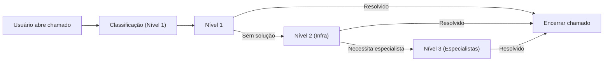

# MI-2025-006 — SLA e Governança Operacional (Infraestrutura)
**Diretoria de Tecnologia da Informação — DITI**  
**Prefeitura Municipal de Hortolândia**  
**Ano-base: 2025**

---

## 1. Finalidade
Estabelecer padrões de atendimento, tempos de resposta, responsabilidades, fluxos de trabalho, indicadores e mecanismos de governança aplicáveis **exclusivamente às atividades de infraestrutura, suporte técnico, redes, data center, equipamentos, conectividade e continuidade operacional**.

Esta MI não se aplica ao desenvolvimento, manutenção evolutiva ou parametrização de sistemas. Tais atividades serão tratadas na MI-2025-007.

---

## 2. Escopo
Este documento rege:

- Suporte técnico Nível 1 (Service Desk)  
- Infraestrutura de TI (Nível 2)  
- Segurança, redes, conectividade  
- Data center, servidores, máquinas virtuais  
- Inventário, backup e continuidade  
- Fornecedores associados à infraestrutura  
- Atividades emergenciais e preventivas  

**Não contempla:**  
- Desenvolvimento de sistemas  
- Manutenção evolutiva  
- Criação de integrações  
- Parametrizações sistêmicas  
- Projetos de software  

Esses processos pertencem à **DSTI** e terão SLA próprio.

---

## 3. Definições
**Chamado:** Registro formal de solicitação ou incidente.  
**Prioridade:** Classificação A (crítica), B (alta), C (moderada).  
**Níveis de atendimento:**  
- **Nível 1:** Service Desk  
- **Nível 2:** Infraestrutura / Redes  
- **Nível 3:** Especialistas de Infra, Segurança ou Banco de Dados  

**TMR:** Tempo médio de resposta.  
**TMS:** Tempo médio de solução.  
**MTTR:** Tempo médio de reparo.  
**Janela de manutenção:** Período autorizado para intervenção preventiva.  
**PCO:** Plano de Correção Obrigatória (uso interno, não punitivo).

---

## 4. Fluxo de Atendimento

### 4.1 Etapas do Processo
1. Abertura do chamado (usuário)  
2. Triagem e classificação (Nível 1)  
3. Atendimento inicial (Nível 1)  
4. Escalonamento para Nível 2  
5. Ação técnica (rede, servidor, equipamento, acesso, backup etc.)  
6. Escalonamento para Nível 3, se necessário  
7. Teste e validação  
8. Encerramento e evidências  
9. Atualização da Base de Conhecimento  

---

### 4.2 Fluxo (diagrama Mermaid)

---

### 4.3 Responsabilidades (RACI)

| Processo / Atividade           | Nível 1 (SD) | Nível 2 (Infra) | Nível 3 (Especialistas) | Secretaria | Fornecedor |
|-------------------------------|--------------|------------------|---------------------------|------------|------------|
| Registro do chamado           | R            | C                | C                         | A          | –          |
| Triagem e classificação       | R            | C                | –                         | –          | –          |
| Suporte remoto                | R            | C                | –                         | –          | –          |
| Suporte presencial            | –            | R                | –                         | –          | –          |
| Incidentes críticos           | C            | R                | A                         | C          | R/C        |
| Backup / Restore              | –            | R                | C                         | –          | –          |
| Monitoramento do Data Center  | –            | R                | C                         | –          | –          |
| Segurança e acessos           | C            | R                | A                         | –          | C          |
| Problemas recorrentes         | C            | R                | R                         | –          | C          |
| Validação do usuário          | –            | –                | –                         | R          | –          |
| Encerramento                  | R            | C                | C                         | –          | –          |

Legenda: **R = responsável**, **A = aprovador**, **C = consultado**  

---

## 5. Tempos de Atendimento (SLA)

### 5.1 Prioridade A — Crítica
- Interrupção total de serviço essencial  
- Rede ou data center indisponível  
- Sistemas críticos sem acesso  
- Falhas que impactam diretamente o cidadão  

**TMR:** até 15 minutos  
**TMS:** até 4 horas  
**Ação obrigatória:** abertura de incidente + relatório pós-evento  

---

### 5.2 Prioridade B — Alta
- Problemas que afetam equipes inteiras  
- Falhas intermitentes de rede  
- Equipamentos essenciais parados  

**TMR:** até 1 hora  
**TMS:** até 12 horas  

---

### 5.3 Prioridade C — Moderada
- Demandas individuais  
- Configurações, ajustes, permissões  
- Troca de periféricos  

**TMR:** até 4 horas  
**TMS:** até 48 horas  

---

## 6. Indicadores de Desempenho (KPIs)

### 6.1 Operacionais
- % de atendimentos dentro do SLA  
- TMR  
- TMS  
- MTTR (infraestrutura)  
- % de chamados reabertos  

### 6.2 Disponibilidade
- Disponibilidade da rede  
- Disponibilidade do data center  
- Disponibilidade da internet  

### 6.3 Segurança
- Incidentes por severidade  
- Aplicação de patches dentro da janela de conformidade  
- Tentativas de acesso bloqueadas  

### 6.4 Continuidade
- Sucesso dos backups diários  
- Sucesso dos testes de restore  
- Registro de falhas de energia (UPS / nobreak)

---

## 7. Governança Operacional

### 7.1 Base de Conhecimento
Todo incidente resolvido deve gerar artigo na BK.

### 7.2 Auditoria Interna
A DITI deve produzir:
- Relatório mensal de SLAs  
- Estatísticas de incidentes  
- Top 10 problemas  

### 7.3 Gestão de Problemas
Incidentes recorrentes devem gerar análise de causa raiz (ACR).

### 7.4 Plano de Correção Obrigatória (PCO)
Aplicado **à equipe ou ao processo**, nunca ao servidor individual.  
O objetivo é **melhorar o fluxo, não punir pessoas**.

---

## 8. Janelas de Manutenção
- Quartas-feiras, 19h–22h  
- Sábados, 08h–12h  

Manutenções emergenciais exigem comunicação imediata.

---

## 9. Fornecedores e Terceiros
Sanções aplicáveis via contrato:
- Advertência  
- Glosa  
- Multa conforme 14.133  
- PCO contratual  

**Jamais aplicável a servidores públicos.**

---

## 10. Conexão com o Data Lakehouse Municipal
A regularidade dessas rotinas garante:
- Coleta sistemática de logs  
- Rastreabilidade de incidentes  
- Dados confiáveis para ETL  
- Aderência às diretrizes RAJIS  
- Governança técnica baseada em evidências  

---

## 11. Vigência
Esta MI entra em vigor na data de sua publicação e deve ser revisada anualmente.

---

## 12. Anexos
- Anexo I — Fluxo Mermaid  
- Anexo II — Tabelas de SLA  
- Anexo III — Relatório de incidente  
- Anexo IV — Matriz RACI expandida  

