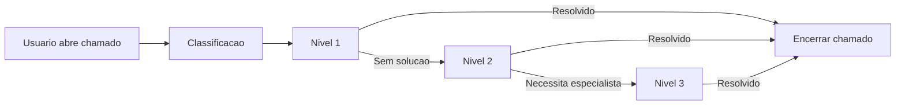

# 🛠️ 06 — SLA e Governança Operacional da TI
*Prefeitura Municipal de Hortolândia — PDTI 2026–2029*

Este documento estabelece os **Acordos de Nível de Serviço (SLA)**, os **processos operacionais**, os **indicadores**, a **estrutura de atendimento** e os **compromissos de governança** para garantir previsibilidade, transparência e alinhamento entre DITI, DSTI e todas as secretarias municipais.

---

## 1. Objetivos do SLA
Os Acordos de Nível de Serviço visam:

- Definir padrões mínimos e mensuráveis de atendimento e operação;
- Estabelecer expectativas claras entre TI e demais secretarias;
- Reduzir gargalos e ruídos operacionais;
- Garantir continuidade e previsibilidade dos serviços essenciais;
- Criar base para indicadores, auditorias e priorização de demandas;
- Suportar a construção do **Data Lakehouse Municipal** (2026–2029).

---

## 2. Escopo dos Serviços Abrangidos
O SLA cobre serviços prestados por DITI e DSTI, incluindo:

- Suporte ao usuário (níveis 1, 2 e 3);
- Data Center, servidores e storages;
- Redes cabeadas, Wi-Fi e conectividade;
- Sistemas corporativos e setoriais;
- Administração de banco de dados;
- Segurança da Informação e LGPD;
- Gestão de incidentes, requisições e mudanças;
- Governança de TI e registros operacionais;
- Projetos estruturantes e integrações.

---

# 3. Classificação dos Serviços e Criticidade
A classificação determina prioridades de atendimento.

## 3.1 Criticidade Alta (Nível A)
**Serviços que impactam diretamente a continuidade da Prefeitura.**

Exemplos:
- Sistemas corporativos críticos (RH, Protocolo, SIGA, Tributário);
- Rede indisponível no Paço ou secretarias essenciais;
- Queda de servidores, banco de dados ou virtualização;
- Falha geral em e-mail ou autenticação institucional.

### SLA para Criticidade Alta
- **Tempo de resposta:** até **30 minutos**  
- **Prazo estimado de solução:** até **4 horas**  
- Atendimento **imediato** por analistas nível 2/3.

---

## 3.2 Criticidade Média (Nível B)
**Afeta setores específicos, mas não paralisa a Prefeitura.**

Exemplos:
- Impressoras, scanners, totens;
- Falhas em sistemas setoriais;
- Problemas de login individual.

### SLA para Criticidade Média
- **Tempo de resposta:** até **2 horas**  
- **Prazo estimado de solução:** até **24 horas úteis**

---

## 3.3 Criticidade Baixa (Nível C)
**Requisições rotineiras ou tarefas sem impacto operacional imediato.**

Exemplos:
- Troca de equipamento;
- Instalação de software autorizado;
- Ajuste de perfil de acesso.

### SLA para Criticidade Baixa
- **Tempo de resposta:** até **8 horas úteis**  
- **Prazo estimado de solução:** até **5 dias úteis**

---
# 4. Fluxo de Atendimento e Governança

## 4.1 Modelo Geral (ITIL 4 Adaptado)

1. **Abertura do chamado** (usuário → Service Desk)  
2. **Classificação automática** (criticidade A/B/C)  
3. **Triagem** (nível 1)  
4. **Escalonamento** (nível 2/3, se necessário)  
5. **Resolução**  
6. **Validação com usuário**  
7. **Encerramento**  
8. **Registro no Catálogo de Problemas** (quando aplicável)

Este fluxo padroniza todo o ciclo de vida de um incidente ou requisição, garantindo previsibilidade, eficiência e rastreabilidade operacional.

---

## 4.2 Fluxo (versão esquemática em Mermaid)

Observacao: Este diagrama pode ser exportado posteriormente para o formato .svg e armazenado na pasta 99-imagens.

## 4.3 Padrões de Responsabilidade

| Etapa do Processo              | Responsável Principal | Apoio |
|-------------------------------|------------------------|-------|
| Abertura do chamado           | Usuário / Secretaria   | —     |
| Classificação e triagem       | Nível 1 (Service Desk) | —     |
| Escalonamento técnico         | DITI/DSTI (Nível 2/3)  | Fornecedores |
| Resolução                     | Equipe técnica         | Fornecedor / Sistemas |
| Validação                     | Usuário solicitante    | —     |
| Encerramento                  | Service Desk           | —     |
| Registro de problema          | Governança de TI       | DITI/DSTI |

---
## 4.3 Padrões de Responsabilidade (Níveis de Atendimento)

A matriz abaixo define as responsabilidades do processo de atendimento a chamados,
estruturada segundo os níveis de suporte (N1, N2 e N3), em conformidade com ITIL v4
e práticas da Prefeitura de Hortolândia.

| Etapa do Processo            | Responsável Principal            | Nível | Apoio                       |
|------------------------------|----------------------------------|-------|-----------------------------|
| **1. Abertura do chamado**   | Usuário / Secretaria             | —     | —                           |
| **2. Classificação e triagem** | Service Desk                    | Nível 1 | —                         |
| **3. Escalonamento técnico** | DITI/DSTI                        | Nível 2 | Fornecedores / Sistemas   |
| **4. Diagnóstico avançado**  | Equipe técnica especializada     | Nível 3 | Fornecedor / Consultoria  |
| **5. Resolução**             | Equipe técnica                   | Nível 2/3 | Fornecedor / Sistemas     |
| **6. Validação**             | Usuário solicitante              | —     | Service Desk               |
| **7. Encerramento**          | Service Desk                     | Nível 1 | —                         |
| **8. Registro da causa raiz** | Governança de TI / DPO (se aplicável) | — | DITI/DSTI                 |

---
## 4.4 Diretrizes Operacionais

- Chamados devem ser **registrados exclusivamente pelo sistema oficial de atendimento**, garantindo rastreabilidade.  
- Escalonamentos devem seguir **fila de prioridade baseada no SLA** (A → B → C).  
- Todo chamado crítico deve gerar ao menos **um registro de incidente** para auditoria.  
- No encerramento, é **proibido** encerrar chamado sem confirmação explícita do usuário (exceto casos de força maior).  
- Problemas recorrentes devem ser classificados como **“Problema”** e tratados como ação preventiva.  
- Toda intervenção técnica deve ser documentada na **base de conhecimento (POP)**.  
- Atendimentos presenciais só ocorrem após triagem e registro formal.

---

## 4.5 Integração com Governança e Auditoria

O fluxo de atendimento integra-se diretamente a:

- **Governança LGPD** (registro, finalidade, minimização e controles);  
- **Controles Internos Municipais**;  
- **Auditorias** internas e externas (Tribunal de Contas, CGM, PGM);  
- **Gestão de Continuidade** (BCP/DRP);  
- **Indicadores estratégicos** (KPIs operacionais e táticos);  
- **Arquitetura de Dados**, como base para:  
  - catálogos, logs e trilhas de auditoria;  
  - ingestão automatizada no **Data Lakehouse Municipal**;  
  - análises de desempenho e previsões futuras.

---
# 5. Indicadores (KPIs) Obrigatórios
KPIs mínimos para monitoramento:

- **% de atendimento no prazo do SLA**  
- **Tempo médio de resposta (TMR)**  
- **Tempo médio de solução (TMS)**  
- **Número de incidentes por secretaria**  
- **Top 10 problemas recorrentes**  
- **Disponibilidade dos sistemas críticos**  
- **Tickets reabertos (%)**  
- **Uso da fila de prioridade (A/B/C)**

---

# 6. Matriz RACI Operacional

| Atividade / Processo                     | DITI | DSTI | Secretaria | Fornecedor |
|------------------------------------------|------|------|------------|-----------|
| Suporte ao usuário                       | R    | A    | C          | C         |
| Administração de redes                   | R    | C    | C          | A/R       |
| Gestão de sistemas corporativos          | C    | R    | C          | A/R       |
| Data Center e virtualização              | R    | C    | C          | A/R       |
| Segurança da Informação                  | R    | C    | C          | C         |
| Backups e contingência                   | R    | C    | C          | C         |
| Projetos e integrações                   | A    | R    | C          | C         |
| Governança e documentação                | A    | R    | C          | C         |

Legenda:  
- **R** = Responsável  
- **A** = Aprovador  
- **C** = Consultado  

---

# 7. Janelas de Manutenção Programada
Manutenções poderão ocorrer em:

- **Quartas-feiras, 19h–22h**  
- **Sábados, 08h–12h**

Avisos devem ser enviados com **48 horas de antecedência**.  
Manutenções emergenciais seguem fluxo de comunicação rápida.

---

# 8. Penalidades e Regras de Prioridade

## 8.1 Penalidades
Para fornecedores terceirizados com SLA contratado:

- Atraso em SLA crítico (A): **–5%** do valor mensal  
- Reincidência superior a 3 meses: **Plano de Correção Obrigatório (PCO)**

## 8.2 Prioridade Institucional
Em caso de demanda simultânea, a ordem é:

1. Serviços críticos do governo;  
2. Processos essenciais ao cidadão;  
3. Sistemas estratégicos;  
4. Demandas operacionais;  
5. Requisições de melhoria.

---

# 9. Conexão com o Data Lakehouse
O cumprimento deste SLA é **pré-requisito** para a implantação do Lakehouse Municipal, pois:

- Aumenta a qualidade e regularidade das coletas;  
- Cria rastreabilidade institucional;  
- Reduz interrupções e falhas operacionais;  
- Estabelece disciplina técnica de governança;  
- Garante maturidade mínima para ingestão contínua.  

---

# 10. Contatos e Escalonamento
- **Nível 1:** Service Desk  
- **Nível 2:** DITI (Infraestrutura)  
- **Nível 3:** DSTI (Sistemas / Banco de Dados)  
- **Escalonamento executivo:** Diretoria / Secretaria de Governo  

---
